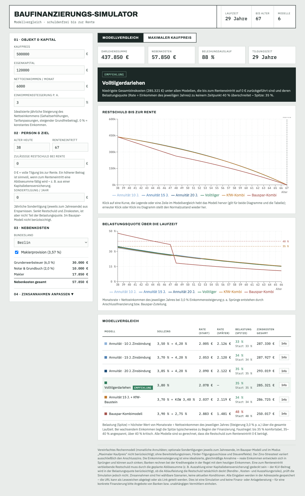

# Baufinanzierungs-Simulator

One-Page-Web-App zum Simulieren und Vergleichen von Baufinanzierungsmodellen –
mit dem Ziel, dass die Finanzierung zum Renteneintritt getilgt ist oder auf eine
definierte Ziel-Restschuld zurückgeführt wird (Ablösung z. B. durch eine fällige
Kapitallebensversicherung).

**Live-Demo:** https://saigyo.github.io/baufinanzierungs-simulator/



## Features

- **Sechs Modelle im Vergleich:** Annuitätendarlehen (10/15/20 J. Zinsbindung mit
  Anschlussfinanzierung), Volltilger, KfW-Kombination, Bauspar-Kombimodell
- **Nebenkosten automatisch** nach Bundesland (Grunderwerbsteuer, Notar/Grundbuch, optional Makler)
- **Anpassbare Zinsannahmen** inkl. Anschlusszins und Bauspar-Parametern
- **Ziel-Restschuld bei Rente** + KLV-Monatsbeitrag in der Belastungsrechnung
- **Einkommenssteigerung p. a.** – Belastungsquote wird gegen das Einkommen des
  jeweiligen Jahres geprüft (Spitzenwert über die Laufzeit)
- **Sondertilgung** (€/Jahr) – senkt Restschuld, Zinskosten und Folge-Raten
- **Zins-Stresstest** – Aufschlag auf den Anschlusszins, Spitzen-Belastung als eigene Spalte
- **Umkehr-Modus:** maximaler Kaufpreis je Modell für frei wählbare Belastungsgrenzen
- **Teilbare Links:** alle Eingaben werden als URL-Parameter gespeichert
- Charts: Restschuldverlauf, Belastungsquote über die Laufzeit, Max-Kaufpreis-Balken

## Setup

Voraussetzung: Node.js ≥ 20.19 (bzw. ≥ 22.12, LTS empfohlen).

```bash
npm install
npm run dev          # Dev-Server mit Hot Reload (http://localhost:5173)
npm test             # Unit-Tests (Vitest); npm run test:watch für den Watch-Modus
```

## Builds

```bash
npm run build              # Produktions-Build nach dist/
npm run preview            # Produktions-Build lokal testen
npm run build:standalone   # EINE eigenständige HTML-Datei:
                           # dist/baufinanzierung-simulator.html
                           # (offline lauffähig, per Doppelklick zu öffnen)
```

## Projektstruktur

```
├── index.html                        Vite-Einstieg
├── src/
│   ├── main.jsx                      React-Bootstrap
│   ├── BaufinanzierungsSimulator.jsx Haupt-Komponente (State, URL-Sync, Layout)
│   ├── styles.js                     CSS (Template-String, per <style> injiziert)
│   ├── lib/                          Logik, React-frei
│   │   ├── constants.js              Grunderwerbsteuer, Farben
│   │   ├── format.js                 eur/pct-Formatierer (de-DE)
│   │   ├── finance.js                Finanzmathematik (annuLoan, buildModels, …)
│   │   ├── finance.test.js           Unit-Tests Finanzmathematik
│   │   ├── persistence.js            URL-Persistenz (DEFAULTS, stateFromURL, …)
│   │   ├── persistence.test.js       Unit-Tests URL-Persistenz
│   │   └── calc.js                   computeCalc/computeInvers (abgeleitete Daten)
│   └── components/                   UI-Komponenten
│       ├── controls.jsx              Field, Num
│       ├── InputPanel.jsx            Eingabe-Sektionen 01–04
│       ├── ComparisonCharts.jsx      Restschuld- & Belastungs-Diagramm (Fokus-Modus)
│       ├── ModelTable.jsx            Modellvergleich-Tabelle
│       ├── MaxPriceSection.jsx       Umkehr-Modus (max. Kaufpreis)
│       └── Footer.jsx                Annahmen & Disclaimer
├── scripts/
│   └── build-standalone.mjs          Single-File-HTML-Build (esbuild)
├── vite.config.js
└── CLAUDE.md                         Projektkontext für Claude Code
```

## Hinweis

Vereinfachtes Rechenmodell (Details im UI-Footer). Dies ist eine Simulation und
keine Finanz- oder Anlageberatung.
